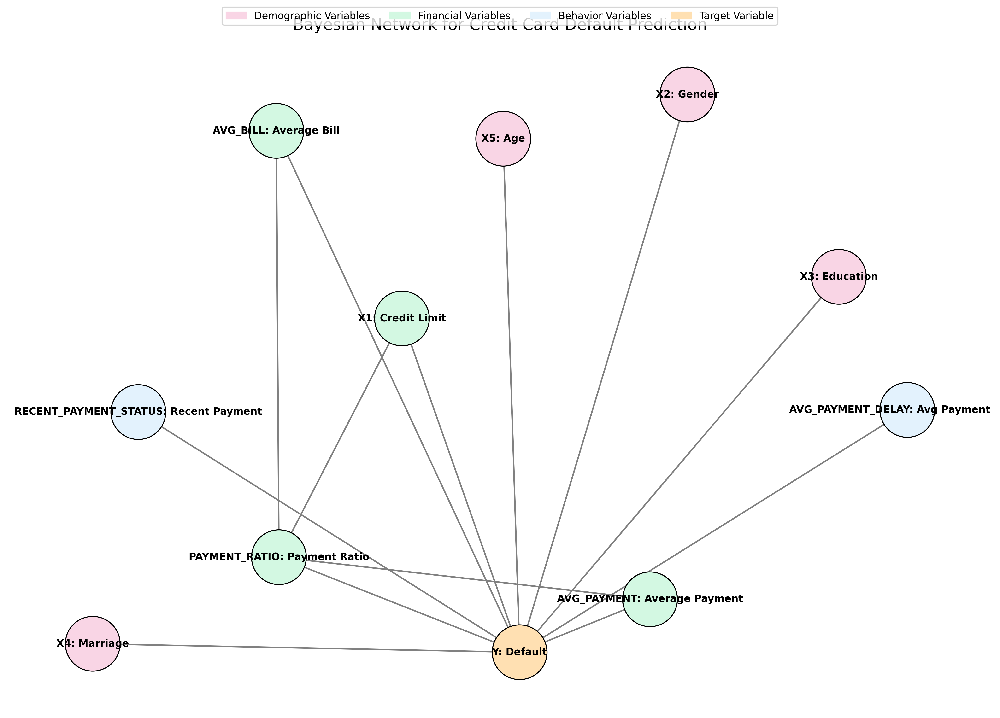

# CSE150A Project - Identifying Credit Card Defaults

## Data Exploration

| Category | Key Findings |
|----------|-------------|
| **Dataset Overview** | • 30,000 entries with 24 columns<br>• All columns are of type int64<br>• Memory usage: 5.5 MB |
| **Missing Values** | • No missing values found in any column |
| **Demographic Variables** | • Gender: 60.37% female, 39.63% male<br>• Education: 46.77% university, 35.28% graduate, 16.39% high school, 1.56% others<br>• Marital Status: 53.21% single, 45.53% married, 1.08% others<br>• Age: Mean 35.49 years, Range 21-79 years |
| **Payment Status** | • Varying patterns of payment behavior<br>• Most accounts current (0) or with slight delays (-1, -2) |
| **Bill Amounts** | • Significant variation with maximum bills ranging from 891,586 to 1,664,089<br>• Negative values present (possible credits)<br>• Median bills range from 17,071 to 22,381 |
| **Payment Amounts** | • Most payments concentrated in lower ranges<br>• Significant outliers present<br>• Median payments around 1,500-2,100 |
| **Class Balance** | • No Default (0): 77.88%<br>• Default (1): 22.12% |
| **Outlier Analysis** | • Credit Amount: 167 outliers<br>• Age: 272 outliers<br>• Bill Amounts: ~2,400-2,725 outliers<br>• Payment Amounts: ~2,700-3,000 outliers |
| **Scale Analysis** | • Credit Amount: 10,000 to 1,000,000<br>• Age: 21 to 79<br>• Bill Amounts: -339,603 to 1,664,089<br>• Payment Amounts: 0 to 1,684,259 |

## Network Probability Analysis

### Target Variable Analysis (Y)
- No Default (0): 77.88%
- Default (1): 22.12%

### Feature Analysis

| Feature | Distribution | Strongest Relationship |
|---------|--------------|------------------------|
| X1 (Credit Amount) | • Level 2: 37.17%<br>• Level 1: 32.06%<br>• Level 0: 30.77% | P(No Default\|X1=2) = 84.87% |
| X2 (Gender) | • Female (2): 60.37%<br>• Male (1): 39.63% | P(No Default\|X2=1) = 79.22% |
| X3 (Education) | • University (2): 46.77%<br>• Graduate (1): 35.28%<br>• High School (3): 16.39%<br>• Others: 1.51% | P(No Default\|X3=0) = 100% |
| X4 (Marital Status) | • Single (2): 53.21%<br>• Married (1): 45.53%<br>• Others (3): 1.08%<br>• Unknown (0): 0.18% | P(No Default\|X4=0) = 90.74% |
| X5 (Age Group) | • Group 1: 34.28%<br>• Group 2: 33.66%<br>• Group 0: 32.06% | P(No Default\|X5=1) = 79.80% |
| Average Payment Delay | • High (2): 57.75%<br>• Low (0): 30.64%<br>• Medium (1): 11.61% | P(No Default\|AVG_PAYMENT_DELAY=1) = 84.47% |
| Average Bill Amount | • High (2): 33.49%<br>• Low (0): 33.29%<br>• Medium (1): 33.22% | P(No Default\|AVG_BILL=2) = 79.19% |
| Average Payment | • High (2): 33.49%<br>• Medium (1): 33.30%<br>• Low (0): 33.20% | P(No Default\|AVG_PAYMENT=2) = 86.09% |
| Payment Ratio | • High (2): 33.40%<br>• Low (0): 33.33%<br>• Medium (1): 33.27% | P(No Default\|PAYMENT_RATIO=2) = 84.69% |

### Feature Relationships
- Average Bill vs Payment Ratio: Correlation -0.5518
- Average Payment vs Payment Ratio: Correlation 0.1187
- Credit Amount vs Payment Ratio: Correlation 0.1864

### Network Statistics
- Total parameters: 898,248
- Nodes: 11
- Edges: 13

## Bayesian Network Structure



The Bayesian network has the following structure:
- **Demographic Nodes**: Gender (X2), Education (X3), Marriage (X4), Age (X5)
- **Financial Nodes**: Credit Limit (X1), Average Bill, Average Payment, Payment Ratio
- **Behavior Nodes**: Recent Payment Status, Average Payment Delay
- **Target Node**: Default (Y)

## Implementation Details

### Libraries Used
I used the **pgmpy** library for building the Bayesian Network and calculating the CPTs:

| Library Component | Purpose |
|-------------------|---------|
| `pgmpy.models.BayesianNetwork` | Creating the network structure |
| `pgmpy.estimators.MaximumLikelihoodEstimator` | Calculating the CPTs |
| `pgmpy.inference.VariableElimination` | Performing probabilistic inference |

### CPT Calculation Method
The Maximum Likelihood Estimator (MLE) in pgmpy calculates the CPTs using the following approach:

1. For each node in the network, it counts the frequency of each possible value of the node given each possible combination of values of its parent nodes.
2. These counts are converted to probabilities by dividing by the total counts for each parent combination.
3. Mathematically, for a node X with parents Pa(X), it calculates:
   - P(X = x | Pa(X) = pa) = (Count of X = x and Pa(X) = pa) / (Count of Pa(X) = pa)

### CPTs in the Network
The model calculates the following conditional probability tables:

#### Demographic CPTs
- P(Y | X2) - Default probability given Gender
- P(Y | X3) - Default probability given Education
- P(Y | X4) - Default probability given Marriage
- P(Y | X5) - Default probability given Age

#### Financial CPTs
- P(PAYMENT_RATIO | X1) - Payment ratio given Credit limit
- P(Y | X1) - Default probability given Credit limit
- P(PAYMENT_RATIO | AVG_BILL) - Payment ratio given Average bill
- P(PAYMENT_RATIO | AVG_PAYMENT) - Payment ratio given Average payment
- P(Y | AVG_BILL) - Default probability given Average bill
- P(Y | AVG_PAYMENT) - Default probability given Average payment

#### Behavior CPTs
- P(Y | RECENT_PAYMENT_STATUS) - Default probability given Recent payment status
- P(Y | AVG_PAYMENT_DELAY) - Default probability given Average payment delay
- P(Y | PAYMENT_RATIO) - Default probability given Payment ratio

### Data Preprocessing
The model first discretizes continuous variables using `KBinsDiscretizer` from scikit-learn (with n_bins=3 and strategy='quantile'), converting them into ordinal categorical variables to make the CPT calculation feasible. This is an important preprocessing step since pgmpy works with discrete variables.

The most complex CPT in the model is for the target variable Y (Default), which has 8 parent nodes according to the network structure, potentially resulting in a large conditional probability table.

## Agent Design using PEAS Framework

| Component | Description |
|-----------|-------------|
| **Performance Metric** | Accuracy of predicting whether a customer will default on their credit card |
| **Environment** | Fully observable, deterministic, episodic, semi-dynamic, continuous, single agent |
| **Actuators** | Screen display showing questions about financial data and prediction |
| **Sensors** | Keyboard for user input and information gathering |
| **Agent Type** | Goal-based agent trying to maximize prediction accuracy |

## Model Performance

```
Classification Report:
              precision    recall  f1-score   support

           0       0.82      0.95      0.88      4687
           1       0.56      0.25      0.34      1313

    accuracy                           0.79      6000
   macro avg       0.69      0.60      0.61      6000
weighted avg       0.76      0.79      0.76      6000

Confusion Matrix:
[[4435  252]
 [ 988  325]]

Accuracy: 0.7933
```

## Conclusion

### Model Performance Analysis
The Bayesian network achieved an accuracy of 79.33%, which means that approximately 4 out of 5 predictions were correct. However, looking deeper at the classification report reveals important nuances:

- **High Performance on Non-Defaults (Class 0)**: 95% recall, meaning the model correctly identified 95% of non-defaulting customers.
- **Lower Performance on Defaults (Class 1)**: Only 25% recall for defaults, indicating that the model missed 75% of actual defaults.
- **Class Imbalance Impact**: The dataset is imbalanced (77.88% non-defaults vs. 22.12% defaults), which helps explain why the model performs better at identifying non-defaults.

### Key Takeaways

1. **Effective Feature Engineering**: The approach of creating aggregate features (AVG_PAYMENT_DELAY, AVG_BILL, AVG_PAYMENT, PAYMENT_RATIO) was effective in simplifying the network while maintaining good predictive power.

2. **Insightful Probabilistic Relationships**: The project revealed important relationships between features:
   - Strong relationship between Payment Ratio and Default
   - Identified that P(No Default | AVG_PAYMENT=2) = 86.09% was among the strongest predictors
   - Found meaningful correlations between variables like AVG_BILL and PAYMENT_RATIO (-0.5518)

3. **Model Interpretability**: A major advantage of the Bayesian network approach is that it provides interpretable probability relationships, unlike black-box models.

### Potential Improvements

1. More sophisticated feature engineering
2. Adaptive binning techniques for continuous variables
3. Hybrid approaches combining Bayesian networks with other models
4. More efficient inference algorithms
5. Focusing on improving the recall for the minority class (defaults), which would likely provide the most value, even if it comes at a slight cost to overall accuracy

The model provides valuable interpretability through its probability relationships, making it useful for understanding customer default risk factors in addition to making predictions.


# Code

```
from ucimlrepo import fetch_ucirepo 
import pandas as pd
import numpy as np
import seaborn as sns
import matplotlib.pyplot as plt
from pgmpy.models import BayesianNetwork
import networkx as nx
import matplotlib.patches as mpatches
from pgmpy.factors.discrete import TabularCPD
from pgmpy.estimators import MaximumLikelihoodEstimator
from pgmpy.inference import VariableElimination
from sklearn.preprocessing import KBinsDiscretizer
from sklearn.model_selection import train_test_split
from sklearn.metrics import accuracy_score, classification_report, confusion_matrix
import warnings
from scipy import stats
warnings.filterwarnings('ignore')
  
# fetch dataset 
default_of_credit_card_clients = fetch_ucirepo(id=350) 
  
# data (as pandas dataframes) 
X = default_of_credit_card_clients.data.features 
y = default_of_credit_card_clients.data.targets 
  
# metadata 
print(default_of_credit_card_clients.metadata) 
  
# variable information 
print(default_of_credit_card_clients.variables) 

df = pd.concat([X, y], axis=1)

print("1. Dataset Overview")
print("-" * 50)
print("\nShape of the dataset:", df.shape)
print("\nFirst few rows of the dataset:")
print(df.head())
print("\nDataset Info:")
print(df.info())

print("\n2. Missing Values Analysis")
print("-" * 50)
missing_values = df.isnull().sum()
print("\nMissing values per column:")
print(missing_values[missing_values > 0] if len(missing_values[missing_values > 0]) > 0 else "No missing values found")

print("\n3. Statistical Summary")
print("-" * 50)
print(df.describe())

plt.figure(figsize=(12, 8))
correlation_matrix = df.corr()
sns.heatmap(correlation_matrix, annot=True, cmap='coolwarm', linewidths=0.5)
plt.title('Correlation Matrix')
plt.tight_layout()
plt.savefig('correlation.png')
plt.close()

print("\n4. Feature-specific Analysis")
print("-" * 50)

print("\nDemographic Variables Analysis:")
print("\nGender Distribution (1 = male, 2 = female):")
print(df['X2'].value_counts(normalize=True))

print("\nEducation Distribution (1 = graduate, 2 = university, 3 = high school, 4 = others):")
print(df['X3'].value_counts(normalize=True))

print("\nMarital Status Distribution (1 = married, 2 = single, 3 = others):")
print(df['X4'].value_counts(normalize=True))

print("\nAge Statistics:")
print(df['X5'].describe())

print("\nPayment Status Distribution:")
payment_cols = ['X6', 'X7', 'X8', 'X9', 'X10', 'X11']
for col in payment_cols:
    print(f"\n{col} (Repayment Status):")
    print(df[col].value_counts().sort_index())

bill_amount_cols = ['X12', 'X13', 'X14', 'X15', 'X16', 'X17']
print("\nBill Amount Statistics:")
print(df[bill_amount_cols].describe())

pay_amount_cols = ['X18', 'X19', 'X20', 'X21', 'X22', 'X23']
print("\nPayment Amount Statistics:")
print(df[pay_amount_cols].describe())

print("\n5. Class Balance Analysis")
print("-" * 50)
print("\nDefault payment distribution:")
print(df['Y'].value_counts(normalize=True))


def detect_outliers(df, columns):
    outliers_summary = {}
    for column in columns:
        Q1 = df[column].quantile(0.25)
        Q3 = df[column].quantile(0.75)
        IQR = Q3 - Q1
        lower_bound = Q1 - 1.5 * IQR
        upper_bound = Q3 + 1.5 * IQR
        outliers = df[(df[column] < lower_bound) | (df[column] > upper_bound)][column]
        outliers_summary[column] = len(outliers)
    return outliers_summary

numerical_cols = ['X1', 'X5'] + ['X12', 'X13', 'X14', 'X15', 'X16', 'X17'] + ['X18', 'X19', 'X20', 'X21', 'X22', 'X23']
outliers = detect_outliers(df, numerical_cols)

print("\n6. Outlier Analysis")
print("-" * 50)
print("\nNumber of outliers per numerical column:")
for col, count in outliers.items():
    print(f"{col}: {count} outliers")

print("\n7. Scale Analysis")
print("-" * 50)
numerical_summary = df[numerical_cols].describe().T
numerical_summary['range'] = numerical_summary['max'] - numerical_summary['min']
print("\nScale analysis for numerical variables:")
print(numerical_summary[['min', 'max', 'range']])

class CreditDefaultAgent:
    def __init__(self, n_bins=3):
        self.n_bins = n_bins
        self.discretizers = {}
        self.model = None
        self.inference = None
        
    def create_features(self, df):
        """Create aggregate features to reduce network complexity"""
        df_new = df.copy()
        
        # Create aggregate features
        # Average payment delay (X6-X11)
        payment_cols = ['X6', 'X7', 'X8', 'X9', 'X10', 'X11']
        df_new['AVG_PAYMENT_DELAY'] = df_new[payment_cols].mean(axis=1)
        
        # Average bill amount (X12-X17)
        bill_cols = ['X12', 'X13', 'X14', 'X15', 'X16', 'X17']
        df_new['AVG_BILL'] = df_new[bill_cols].mean(axis=1)
        
        # Average payment amount (X18-X23)
        pay_cols = ['X18', 'X19', 'X20', 'X21', 'X22', 'X23']
        df_new['AVG_PAYMENT'] = df_new[pay_cols].mean(axis=1)
        
        # Payment ratio
        df_new['PAYMENT_RATIO'] = df_new['AVG_PAYMENT'] / df_new['AVG_BILL'].replace(0, 1)
        
        # Recent payment status
        df_new['RECENT_PAYMENT_STATUS'] = df_new['X6']  # Most recent payment status
        
        # Select relevant features
        selected_features = [
            'X1',           # Credit limit
            'X2', 'X3', 'X4', 'X5',  # Demographics (sex, education, marriage, age)
            'RECENT_PAYMENT_STATUS',  # Most recent payment status
            'AVG_PAYMENT_DELAY',      # Payment delay pattern
            'AVG_BILL',              # Average bill amount
            'AVG_PAYMENT',           # Average payment amount
            'PAYMENT_RATIO'          # Payment to bill ratio
        ]
        
        return df_new[selected_features]
    
    def prepare_data(self, df, fit=True):
        """Prepare data for Bayesian Network"""
        df_discrete = df.copy()
        
        # Discretize continuous variables
        continuous_features = ['X1', 'X5', 'AVG_BILL', 'AVG_PAYMENT', 
                             'PAYMENT_RATIO', 'AVG_PAYMENT_DELAY']
        
        for column in continuous_features:
            if column in df.columns:
                if fit:
                    discretizer = KBinsDiscretizer(n_bins=self.n_bins, encode='ordinal', strategy='quantile')
                    df_discrete[column] = discretizer.fit_transform(df[column].values.reshape(-1, 1)).ravel()
                    self.discretizers[column] = discretizer
                else:
                    if column in self.discretizers:
                        df_discrete[column] = self.discretizers[column].transform(df[column].values.reshape(-1, 1)).ravel()
        
        # Ensure all variables are discrete and of integer type
        for column in df_discrete.columns:
            df_discrete[column] = df_discrete[column].astype(int)
        
        return df_discrete
    
    def define_network_structure(self):
        """Define simplified Bayesian Network structure"""
        edges = [
            # Demographic influences
            ('X2', 'Y'),    # Gender
            ('X3', 'Y'),    # Education
            ('X4', 'Y'),    # Marriage
            ('X5', 'Y'),    # Age
            
            # Financial influences
            ('X1', 'PAYMENT_RATIO'),  # Credit limit
            ('X1', 'Y'),
            
            # Payment behavior
            ('RECENT_PAYMENT_STATUS', 'Y'),
            ('AVG_PAYMENT_DELAY', 'Y'),
            ('PAYMENT_RATIO', 'Y'),
            
            # Bill and payment relationships
            ('AVG_BILL', 'PAYMENT_RATIO'),
            ('AVG_PAYMENT', 'PAYMENT_RATIO'),
            ('AVG_BILL', 'Y'),
            ('AVG_PAYMENT', 'Y')
        ]
        
        return BayesianNetwork(edges)
    
    def fit(self, X, y):
        """Train the Bayesian Network"""
        # Create aggregate features
        X_processed = self.create_features(X)
        
        # Combine with target
        if isinstance(y, np.ndarray):
            y = pd.Series(y.ravel(), name='Y')
        data = pd.concat([X_processed, y], axis=1)
        
        # Prepare data
        print("Preparing data...")
        data_discrete = self.prepare_data(data, fit=True)
        
        # Define network structure
        print("Defining network structure...")
        self.model = self.define_network_structure()
        
        # Fit the model
        print("Estimating CPDs...")
        self.model.fit(data_discrete, estimator=MaximumLikelihoodEstimator)
        
        # Initialize inference engine
        self.inference = VariableElimination(self.model)
        
        return self
    
    def predict(self, X):
        """Predict default probability for new data"""
        # Create aggregate features
        X_processed = self.create_features(X)
        
        # Prepare data
        X_discrete = self.prepare_data(X_processed, fit=False)
        
        predictions = []
        for _, instance in X_discrete.iterrows():
            evidence = {col: int(instance[col]) for col in X_discrete.columns}
            try:
                result = self.inference.query(variables=['Y'], evidence=evidence)
                pred = 1 if result.values[1] > result.values[0] else 0
            except:
                pred = 0
            predictions.append(pred)
        
        return np.array(predictions)

def evaluate_agent():
    # Split the data
    X_train, X_test, y_train, y_test = train_test_split(X, y, test_size=0.2, random_state=42)
    
    # Initialize and train the agent
    print("Initializing Credit Default Agent...")
    agent = CreditDefaultAgent(n_bins=3)
    
    print("Training the agent...")
    agent.fit(X_train, y_train)
    
    # Make predictions
    print("\nMaking predictions...")
    y_pred = agent.predict(X_test)
    
    # Evaluate performance
    print("\nModel Performance:")
    print("\nClassification Report:")
    print(classification_report(y_test, y_pred))
    
    print("\nConfusion Matrix:")
    print(confusion_matrix(y_test, y_pred))
    
    # Calculate accuracy
    accuracy = accuracy_score(y_test, y_pred)
    print(f"\nAccuracy: {accuracy:.4f}")
    
    return agent, accuracy

# Run evaluation
agent, accuracy = evaluate_agent()

def analyze_variable_distributions(data, variable_name):
    """Analyze the distribution of a variable in the data"""
    print(f"\nAnalysis for {variable_name}:")
    print("-" * 40)
    
    # Get value counts and convert to probabilities
    value_counts = data[variable_name].value_counts()
    probabilities = value_counts / len(data)
    
    print("Probability Distribution:")
    for value, prob in probabilities.items():
        print(f"Value {value}: {prob:.4f}")
    
    print(f"\nUnique values: {len(value_counts)}")
    print(f"Most common value: {value_counts.index[0]} (P={probabilities.iloc[0]:.4f})")
    print(f"Least common value: {value_counts.index[-1]} (P={probabilities.iloc[-1]:.4f})")

def calculate_conditional_probabilities(data, target, feature):
    """Calculate conditional probabilities P(target|feature)"""
    print(f"\nConditional Probabilities P({target}|{feature}):")
    print("-" * 40)
    
    # Calculate joint probabilities
    joint_counts = pd.crosstab(data[feature], data[target])
    joint_probs = joint_counts.div(joint_counts.sum().sum())
    
    # Calculate conditional probabilities
    cond_probs = joint_counts.div(joint_counts.sum(axis=1), axis=0)
    
    print("\nConditional Probability Table:")
    print(cond_probs)
    
    # Find strongest relationships
    max_prob = cond_probs.max().max()
    max_indices = np.where(cond_probs == max_prob)
    
    print(f"\nStrongest relationship:")
    print(f"P({target}={max_indices[1][0]}|{feature}={max_indices[0][0]}) = {max_prob:.4f}")

def analyze_network_probabilities(data, agent):
    """Analyze probabilities in the Bayesian Network"""
    print("Analyzing Network Probabilities")
    print("=" * 50)
    
    # Analyze target variable
    print("\nTarget Variable Analysis:")
    print("-" * 40)
    analyze_variable_distributions(data, 'Y')
    
    key_features = [
        'X1',           # Credit limit
        'X2',           # Gender
        'X3',           # Education
        'X4',           # Marriage
        'X5',           # Age
        'AVG_PAYMENT_DELAY',  # Average payment delay
        'AVG_BILL',          # Average bill amount
        'AVG_PAYMENT',       # Average payment amount
        'PAYMENT_RATIO'      # Payment to bill ratio
    ]
    
    print("\nFeature Analysis:")
    for feature in key_features:
        if feature in data.columns:
            print("\n" + "=" * 50)
            print(f"Analysis for {feature}")
            
            # Analyze feature distribution
            analyze_variable_distributions(data, feature)
            
            # Calculate conditional probabilities with target
            calculate_conditional_probabilities(data, 'Y', feature)
            
            # Additional analysis for specific feature types
            if feature in ['AVG_PAYMENT_DELAY', 'PAYMENT_RATIO']:
                print(f"\nDetailed statistics for {feature}:")
                print(data[feature].describe())

    print("\nFeature Relationships:")
    print("=" * 50)
    key_relationships = [
        ('AVG_BILL', 'PAYMENT_RATIO'),
        ('AVG_PAYMENT', 'PAYMENT_RATIO'),
        ('X1', 'PAYMENT_RATIO')  # Credit limit vs payment ratio
    ]
    
    for feature1, feature2 in key_relationships:
        if feature1 in data.columns and feature2 in data.columns:
            correlation = data[feature1].corr(data[feature2])
            print(f"\nCorrelation between {feature1} and {feature2}: {correlation:.4f}")
            
            # Calculate conditional probabilities if both features are discrete
            if data[feature1].nunique() <= 10 and data[feature2].nunique() <= 10:
                calculate_conditional_probabilities(data, feature2, feature1)

    print("\nNetwork Statistics:")
    print("=" * 50)
    
    # Count number of parameters
    total_parameters = 0
    for node in agent.model.nodes():
        if node in data.columns:
            cpd = agent.model.get_cpds(node)
            if cpd is not None:
                total_parameters += np.prod(cpd.values.shape)
    
    print(f"Total number of parameters: {total_parameters}")
    print(f"Number of nodes: {len(agent.model.nodes())}")
    print(f"Number of edges: {len(agent.model.edges())}")
    
    return {
        'target_distribution': data['Y'].value_counts(normalize=True).to_dict(),
        'feature_distributions': {
            feature: data[feature].value_counts(normalize=True).to_dict()
            for feature in key_features if feature in data.columns
        },
        'network_stats': {
            'total_parameters': total_parameters,
            'num_nodes': len(agent.model.nodes()),
            'num_edges': len(agent.model.edges())
        }
    }

if agent.model and hasattr(agent, 'model'):
    print("Preparing data for probability analysis...")
    
    X_processed = agent.create_features(X)
    
    discrete_data = agent.prepare_data(X_processed, fit=False)
    
    discrete_data['Y'] = y
    
    probability_analysis = analyze_network_probabilities(discrete_data, agent)
    
    print("\nSummary of Key Findings:")
    print("=" * 50)
    print("\n1. Target Distribution:")
    for value, prob in probability_analysis['target_distribution'].items():
        print(f"Class {value}: {prob:.4f}")
    
    print("\n2. Most Influential Features:")
    for feature, dist in probability_analysis['feature_distributions'].items():
        if len(dist) <= 5:  # Only show compact distributions
            print(f"\n{feature}:")
            for value, prob in dist.items():
                print(f"  Value {value}: {prob:.4f}")
    
    print("\n3. Network Complexity:")
    stats = probability_analysis['network_stats']
    print(f"Total parameters: {stats['total_parameters']}")
    print(f"Number of nodes: {stats['num_nodes']}")
    print(f"Number of edges: {stats['num_edges']}")
else:
    print("Error: Model not properly initialized. Please train the agent first.")
def visualize_bayesian_network():
    # Create a directed graph
    G = nx.DiGraph()
    
    # Define nodes by categories
    demographic_nodes = ['X2: Gender', 'X3: Education', 'X4: Marriage', 'X5: Age']
    financial_nodes = ['X1: Credit Limit', 'AVG_BILL: Average Bill', 'AVG_PAYMENT: Average Payment', 'PAYMENT_RATIO: Payment Ratio']
    behavior_nodes = ['RECENT_PAYMENT_STATUS: Recent Payment', 'AVG_PAYMENT_DELAY: Avg Payment Delay']
    target_node = ['Y: Default']
    
    # Add all nodes to the graph
    all_nodes = demographic_nodes + financial_nodes + behavior_nodes + target_node
    G.add_nodes_from(all_nodes)
    
    # Define the edges (connections between nodes)
    edges = [
        # Demographic influences
        ('X2: Gender', 'Y: Default'),
        ('X3: Education', 'Y: Default'),
        ('X4: Marriage', 'Y: Default'),
        ('X5: Age', 'Y: Default'),
        
        # Financial influences
        ('X1: Credit Limit', 'PAYMENT_RATIO: Payment Ratio'),
        ('X1: Credit Limit', 'Y: Default'),
        
        # Payment behavior
        ('RECENT_PAYMENT_STATUS: Recent Payment', 'Y: Default'),
        ('AVG_PAYMENT_DELAY: Avg Payment Delay', 'Y: Default'),
        ('PAYMENT_RATIO: Payment Ratio', 'Y: Default'),
        
        # Bill and payment relationships
        ('AVG_BILL: Average Bill', 'PAYMENT_RATIO: Payment Ratio'),
        ('AVG_PAYMENT: Average Payment', 'PAYMENT_RATIO: Payment Ratio'),
        ('AVG_BILL: Average Bill', 'Y: Default'),
        ('AVG_PAYMENT: Average Payment', 'Y: Default')
    ]
    
    # Add edges to the graph
    G.add_edges_from(edges)
    
    # Create a figure with a specific size
    plt.figure(figsize=(14, 10))
    
    # Define node positions using a hierarchical layout
    pos = nx.spring_layout(G, seed=42)  # Alternative layout if pygraphviz is not available
    
    # Define node colors by category
    node_colors = []
    for node in G.nodes():
        if node in demographic_nodes:
            node_colors.append('#f9d5e5')  # Pink for demographic
        elif node in financial_nodes:
            node_colors.append('#d3f8e2')  # Green for financial
        elif node in behavior_nodes:
            node_colors.append('#e3f2fd')  # Blue for behavior
        else:
            node_colors.append('#ffe0b2')  # Orange for target
    
    # Draw the nodes with different colors
    nx.draw_networkx_nodes(G, pos, node_size=3000, node_color=node_colors, edgecolors='black')
    
    # Draw the edges
    nx.draw_networkx_edges(G, pos, edge_color='gray', arrows=True, arrowsize=20, width=1.5)
    
    # Draw the labels with adjusted font size
    nx.draw_networkx_labels(G, pos, font_size=10, font_weight='bold')
    
    # Create a legend
    demographic_patch = mpatches.Patch(color='#f9d5e5', label='Demographic Variables')
    financial_patch = mpatches.Patch(color='#d3f8e2', label='Financial Variables')
    behavior_patch = mpatches.Patch(color='#e3f2fd', label='Behavior Variables')
    target_patch = mpatches.Patch(color='#ffe0b2', label='Target Variable')
    plt.legend(handles=[demographic_patch, financial_patch, behavior_patch, target_patch], 
              loc='upper center', bbox_to_anchor=(0.5, 1.05), ncol=4)
    
    # Add title
    plt.title('Bayesian Network for Credit Card Default Prediction', fontsize=16)
    
    # Remove axes
    plt.axis('off')
    
    # Adjust the layout
    plt.tight_layout()
    
    # Show the plot
    plt.savefig('bayesian_network_visualization.png', dpi=300, bbox_inches='tight')
    plt.show()
    
    # Print model information
    print("Bayesian Network Structure:")
    print(f"Number of nodes: {len(G.nodes())}")
    print(f"Number of edges: {len(G.edges())}")
    print("\nNode Categories:")
    print(f"Demographic Variables: {demographic_nodes}")
    print(f"Financial Variables: {financial_nodes}")
    print(f"Behavior Variables: {behavior_nodes}")
    print(f"Target Variable: {target_node}")
    
visualize_bayesian_network()
```