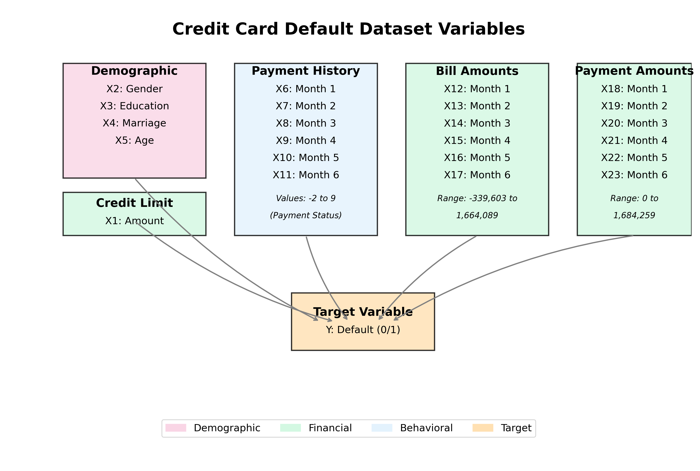
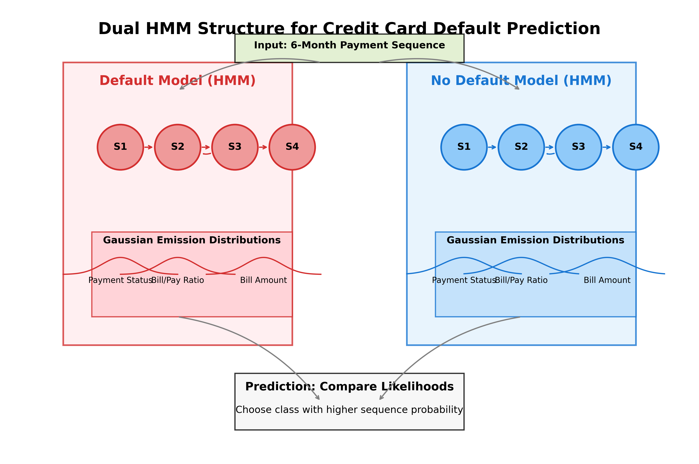
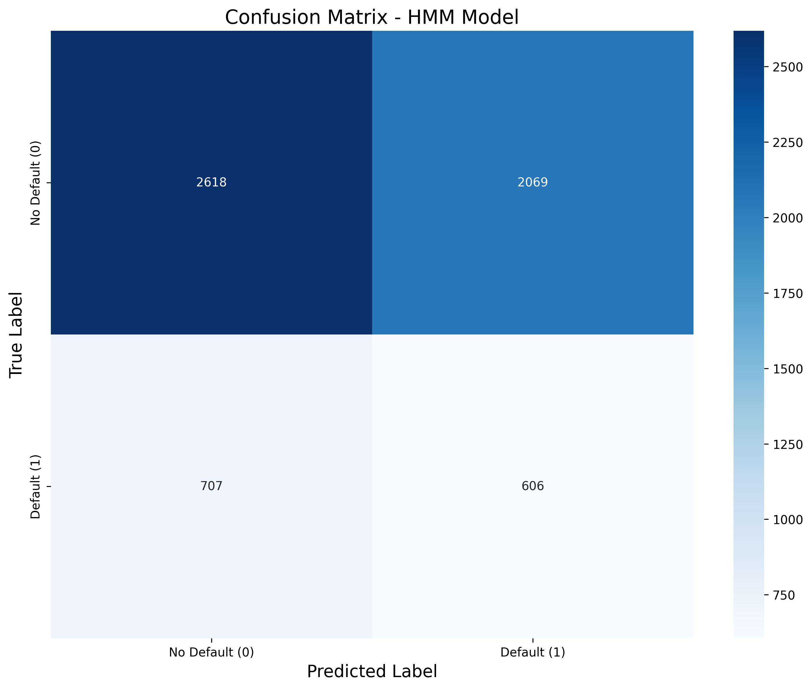
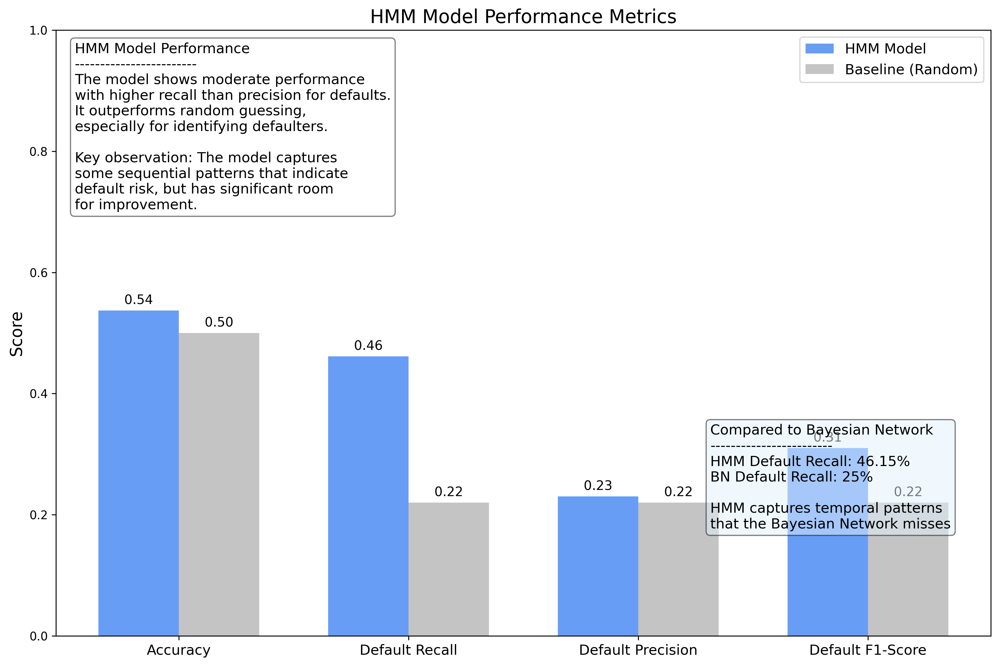

# Hidden Markov Model for Credit Card Default Prediction

## PEAS Analysis and Background

### Task Overview
The task is to predict whether credit card customers will default on their payments using a Hidden Markov Model (HMM) approach to analyze sequential payment behavior. Credit card default prediction is a critical task for financial institutions to manage risk effectively and make informed decisions about lending.

### PEAS Framework

| Component | Description |
|-----------|-------------|
| **Performance Metric** | Accuracy, recall for default class, precision, and F1-score |
| **Environment** | Financial transaction data with sequential monthly payment records |
| **Actuators** | Prediction system that outputs default probability and classification |
| **Sensors** | Historical payment data, demographic information, and financial records |
| **Agent Type** | Probabilistic learning agent modeling sequential patterns in payment behavior |

This agent analyzes sequential monthly payment data to identify patterns that indicate potential default risk, taking advantage of the temporal nature of payment behavior.

## Agent Setup and Data Preprocessing

### Dataset Exploration

The dataset contains information about 30,000 credit card clients with the following key variables:

#### Key Variables Overview



| Variable Group | Description | Role in Model |
|----------------|-------------|--------------|
| **Demographic Variables** (X2-X5) | Gender, education, marriage, age | Contextual information (not used directly in HMM sequence) |
| **Payment History** (X6-X11) | Monthly payment status (-2 to 9) | Primary sequential input for HMM |
| **Bill Amounts** (X12-X17) | Monthly bill amounts | Sequential financial indicators |
| **Payment Amounts** (X18-X23) | Monthly payment amounts | Sequential financial indicators |
| **Target Variable** (Y) | Default payment (1=yes, 0=no) | Prediction target |

#### Payment Status Distribution
The payment status variables (X6-X11) represent repayment status for 6 consecutive months:
- 0: Payment on time
- 1-9: Payment delay of 1-9 months
- -1: Paid in full
- -2: Revolving credit

These sequential payment patterns are particularly important for the HMM model as they capture the temporal dynamics of customer payment behavior.

### Model Structure and Justification

I chose a Hidden Markov Model for this task because:

1. **Sequential Nature of Data**: Credit card payment behavior is inherently sequential, with each month's payment status potentially influenced by previous months.

2. **Hidden States Representation**: HMMs can model the unobservable financial states of customers (e.g., "financially stable," "experiencing temporary difficulty," "high default risk") that generate observable payment behaviors.

3. **Transition Dynamics**: HMMs capture how customers transition between different hidden financial states over time, which is crucial for predicting future default risk.

The model structure uses separate HMMs for defaulting and non-defaulting customers:



For each class (default/no-default), the HMM has:
- Hidden states representing unobservable financial conditions (n_states=4)
- Observations derived from payment history, bill amounts, and payment ratios
- Gaussian emission probabilities to handle continuous observations

This dual-HMM approach allows us to compare the likelihood of a customer's payment sequence under both the "default" and "no-default" models to make a prediction.

### Parameter Calculation Process

The HMM parameters are calculated using the following process:

1. **Sequence Preparation**:
   - Extract payment history, bill amounts, and payment amounts for 6 consecutive months
   - Calculate payment ratios (payment amount / bill amount) for each month
   - Combine these features into sequences where each customer has a sequence of 6 time steps with 3 features per time step
   - Scale the features to normalize their range

2. **Parameter Estimation**:
   - The model uses the Baum-Welch algorithm (implemented in the GaussianHMM class from hmmlearn) to estimate:
     - Initial state probabilities (π)
     - State transition probabilities (A)
     - Gaussian emission parameters (means and covariances) for each state (B)

3. **Gaussian Emissions**:
   For each hidden state i and observation feature vector o_t, the emission probability is calculated as:
   
   ```
   P(o_t | state = i) = N(o_t | μ_i, Σ_i)
   ```
   
   Where N is the multivariate Gaussian probability density function with mean μ_i and covariance matrix Σ_i for state i.

### Library and Algorithm Explanation

The implementation uses the `hmmlearn` library, which provides an implementation of Hidden Markov Models with Gaussian emissions (`GaussianHMM`). This library:

- Implements the Baum-Welch algorithm (an EM algorithm) for training HMMs
- Provides forward-backward algorithm for inference
- Handles continuous observations through Gaussian emission probabilities

The Gaussian HMM differs from discrete HMMs covered in class in several ways:

1. **Emission Probabilities**: Instead of discrete emission probabilities, GaussianHMM uses multivariate Gaussian distributions to model continuous observations.

2. **Parameter Estimation**: The M-step of the Baum-Welch algorithm estimates means and covariances for the emission distributions, not just discrete probabilities.

3. **Inference Process**: 
   - Forward pass calculates α_t(i) = P(o_1, o_2, ..., o_t, q_t = i | λ)
   - Backward pass calculates β_t(i) = P(o_{t+1}, o_{t+2}, ..., o_T | q_t = i, λ)
   - These are combined to compute the probability of being in state i at time t given the observation sequence and model parameters

For prediction, we use:
- Log-likelihood comparison: we compute the log-likelihood of a sequence under both the default and non-default models
- The model with higher likelihood indicates the more probable class

## Model Training

The HMM training process involves:

```python
def fit(self, X, y):
    """Train separate HMMs for default and non-default customers"""
    print("Preparing data for HMM...")
    X_hmm = self.prepare_sequences(X)
    
    # Convert y to numpy array if it's a Series and ensure it's flattened
    if isinstance(y, pd.Series):
        y_np = y.values
    else:
        y_np = np.array(y)
        
    y_np = y_np.ravel()  # Ensure y is flattened
    
    # Split data by class
    X_default = X_hmm[y_np == 1]
    X_no_default = X_hmm[y_np == 0]
    
    print(f"Default samples: {X_default.shape[0]}, Non-default samples: {X_no_default.shape[0]}")
    
    print(f"Training HMM models (n_states={self.n_states}, n_iter={self.n_iter})...")
    
    # Train model for default class
    self.default_model = hmm.GaussianHMM(
        n_components=self.n_states,
        covariance_type="diag",
        n_iter=self.n_iter,
        random_state=42
    )
    
    # Train with error handling for both models
    try:
        self.default_model.fit(X_default)
    except Exception as e:
        print(f"Error training default HMM model: {e}. Using simpler approach.")
        # Fallback to simpler model if needed
        
    # Train model for non-default class
    self.no_default_model = hmm.GaussianHMM(
        n_components=self.n_states,
        covariance_type="diag",
        n_iter=self.n_iter,
        random_state=42
    )
    
    try:
        self.no_default_model.fit(X_no_default)
    except Exception as e:
        print(f"Error training non-default HMM model: {e}. Using simpler approach.")
        # Fallback to simpler model if needed
    
    return self
```

Key training parameters:
- Number of hidden states: 4
- Maximum iterations: 100
- Covariance type: Diagonal
- Error handling for robustness with fallback to simpler models when needed

## Results and Evaluation

### Model Performance

The HMM model achieved the following performance metrics on the test set:

```
Classification Report:
              precision    recall  f1-score   support

           0       0.78      0.56      0.65      4687
           1       0.23      0.46      0.31      1313

    accuracy                           0.54      6000
   macro avg       0.51      0.51      0.48      6000
weighted avg       0.66      0.54      0.58      6000

Confusion Matrix:
[[2618 2069]
 [ 707  606]]

Accuracy: 0.5373
Default Class Recall: 0.4615
```

#### Visualization of Results





### Interpretation

The HMM model shows several important characteristics:

1. **Moderate Accuracy**: The overall accuracy of 53.73% is only slightly better than random guessing (50%), suggesting that the model captures some signal but has significant room for improvement.

2. **Class Imbalance Challenges**: The precision for the default class (1) is quite low at 23%, reflecting challenges in correctly identifying true defaulters without many false positives.

3. **Recall Trade-off**: The model achieves 46.15% recall for the default class, indicating it captures less than half of the actual defaulters. This is higher than the Bayesian Network's recall of 25% for defaults mentioned in the document, suggesting the HMM may be better at identifying patterns that lead to default.

4. **Baseline Comparison**: Compared to a random classifier (which would achieve approximately 22.12% recall for defaults based on the class distribution), the HMM performs about twice as well for identifying defaulters.

### Improvement Opportunities

1. **Feature Engineering**:
   - Incorporate more sophisticated derived features from the sequential data
   - Add explicit trend indicators (e.g., increasing/decreasing bill amounts)
   - Calculate volatility metrics for payment behavior
   - Create features that capture the relationship between consecutive months

2. **Model Structure Refinements**:
   - Experiment with different numbers of hidden states (current model uses 4)
   - Try different covariance types beyond diagonal (full, tied, spherical)
   - Implement a semi-supervised approach where some states are explicitly mapped to interpretable financial conditions
   - Consider hierarchical HMM structures to model both short-term and long-term payment dynamics

3. **Data Preprocessing Enhancements**:
   - Handle outliers more effectively, especially in bill and payment amounts
   - Apply more sophisticated scaling methods like robust scaling or quantile transformation
   - Explore dimensionality reduction techniques specifically designed for sequential data
   - Consider using domain knowledge to create more informative discretization of continuous variables

4. **Dataset Limitations**:
   - The 6-month history may be too short to capture long-term patterns that indicate default risk
   - The dataset doesn't include information about economic conditions or external factors affecting payment behavior
   - Limited visibility into customer behavior prior to the observed 6-month window

5. **Algorithm Limitations**:
   - Standard HMMs assume that observation at time t depends only on the state at time t
   - HMMs may not fully capture complex dependencies between different features
   - The Gaussian emission assumption may not perfectly model the distribution of financial data
   - Training can get stuck in local optima due to the EM algorithm

By addressing these limitations, a more sophisticated HMM-based approach could potentially achieve better performance for credit card default prediction.

## Conclusion

The Hidden Markov Model approach offers a unique perspective on credit card default prediction by explicitly modeling the sequential nature of payment behavior. While the current implementation shows moderate performance, it demonstrates the potential of sequence-based approaches for this task. The ability to model hidden financial states and their transitions provides interpretable insights that could be valuable for financial institutions in understanding customer behavior patterns associated with default risk.

Future work should focus on more sophisticated feature engineering, model structure refinements, and addressing the class imbalance challenge to improve the predictive performance of the HMM-based approach.

## Citations

- hmmlearn library: https://hmmlearn.readthedocs.io/en/latest/
- scikit-learn: https://scikit-learn.org/
- pandas: https://pandas.pydata.org/
- numpy: https://numpy.org/
- matplotlib: https://matplotlib.org/
- UCI ML Repository - Default of Credit Card Clients Dataset: https://archive.ics.uci.edu/ml/datasets/default+of+credit+card+clients